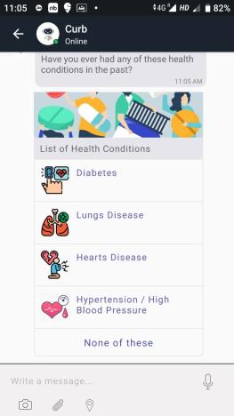
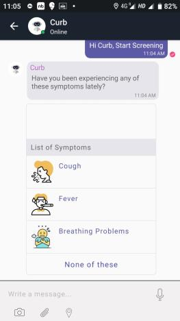
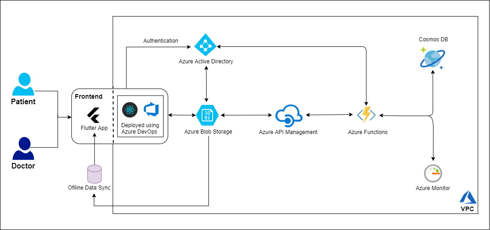

<h1 align="center">CHIKITSAK  AGBI Digital HealthTech Grand Challenge</H1>

   

<h1 align="center">About</H1>

Chikitsak has been made to scale up the existing telemedicine for doctors network and patient's welfare monitoring with key focus on rural/remote areas by using AI based Chatbot that allows two way communication 24/7. All data is held in a cloud serverless architecture, Integrating cloud tech with Patient MIS and Aadhaar authentication, in order to make it easy for patients belonging to low socio economic and educational backgrounds for safe keeping of medical records and also for accessing the databases by emergency medical technicians by merely using biometric / thumb impressions.

## Getting Started
### UI of Chikitsak 
***
### `For Reference Purpose`

## High Level Design of Chikitsak 📌
***
### `For Deployment Purpose`

 
### Developed using Flutter, React and Serverless Cloud Architecture, runs with 100% uptime on cross platform Android | iOS | Web.
